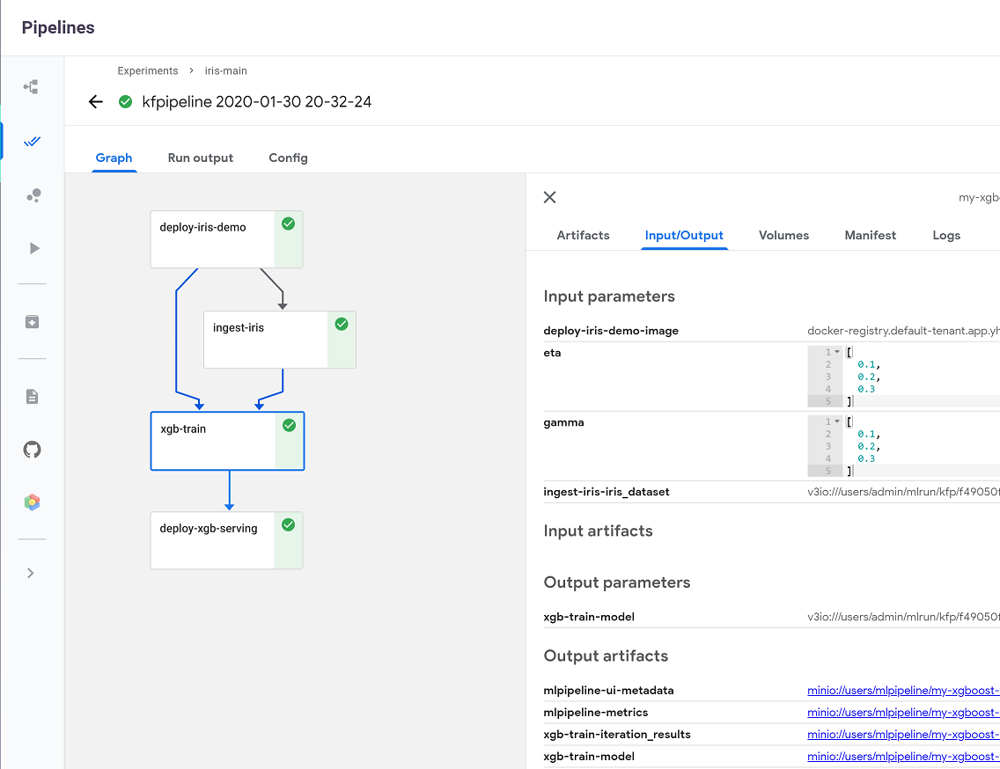

# MLRun ML Project and MLOps demo

Demo the work of MLRun with Github based projects and automated CI/CD<br>
Using the Iris dataset and XGBoost Classification with Hyper-Parameters search.

<br><p align="center"></p><br>

The following examples demonstrate complete machine learning pipelines which include data collection, data preparation, 
model training and automated deployment. 

The examples demonstrate how you can:
 * Run pipelines locally on a notebook.
 * Run some or all tasks on an elastic Kubernetes cluster using serverless functions/jobs.
 * Create automated ML workflows using [KubeFlow Pipelines](https://www.kubeflow.org/docs/pipelines/overview/pipelines-overview/).
 * Maintain project lifecycle

The demo applications are tested on the [Iguazio's Data Science PaaS](https://www.iguazio.com/), 
and use Iguazio's shared data fabric (v3io), and can be modified to work with any shared file storage by replacing the 
```apply(v3io_mount())``` calls with other KubeFlow volume modifiers (e.g. `apply(mlrun.platforms.mount_pvc())`) . 
You can request a [free trial of Iguazio PaaS](https://www.iguazio.com/lp/14-day-free-trial-in-the-cloud/).

## Running the demo

Pre-requisites:
* A Kubernetes cluster with pre-installed KubeFlow, Nuclio.
* MLRun Service and UI installed, [see MLRun readme](https://github.com/mlrun/mlrun).

1. Clone this repo to your own Git.<br>
2. in a client or notebook properly configured with MLRun and KubeFlow run:

`mlrun project my-proj/ -u git://github.com/<your-fork>/demo-xgb-project.git`

3. Run the [local playground notebook](notebooks/train-xgboost.ipynb) to build, test, and run functions.

4. Open the [project notebook](load-project.ipynb) and follow the instructions to run an automated ML Pipeline and source control.

> Note: alternatively you can run the `main` pipeline from the CLI and specify artifacts path using:

`mlrun project my-proj/ -r main -p "v3io:///users/admin/kfp/{{workflow.uid}}/"`


## Files

* [Project Notebook (load and run workflows)](load-project.ipynb)
* [Project spec (functions, workflows, etc)](project.yaml)
* [Local XGBoost function spec (generated from notebook)](src/iris.yaml)
* [Function Notebook (code, test, build, run)](notebooks/train-xgboost.ipynb)
* [Function code (generated from notebook)](src/iris.py)
* [Workflow code (init + dsl)](src/workflow.py)


## Pipeline

<br><p align="center"></p><br>
